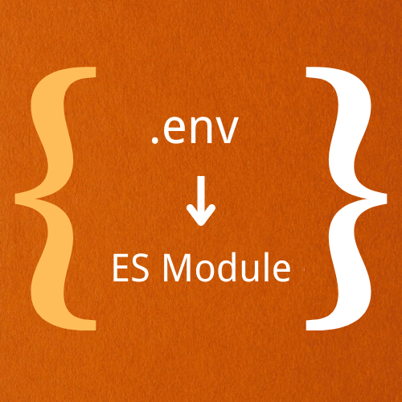

# vite-plugin-env-transform-module

This is a vite plugin. It parses the configuration from your `.env` file into an object and allows you to import it as an ES module in your code.

English | [简体中文](./README.zh-CN.md)

## Installation

```
pnpm i -D vite-plugin-env-transform-module
```

## Usage

> TODO

```ts
// vite.config.ts
import { defineConfig } from "vite";
import { envTransformModule } from "vite-plugin-env-transform-module";

export default defineConfig({
  plugins: [],
});
```

see [example](./examples/)

## Options


